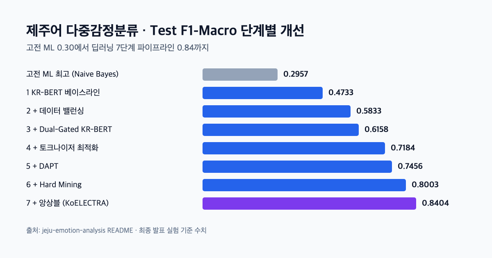
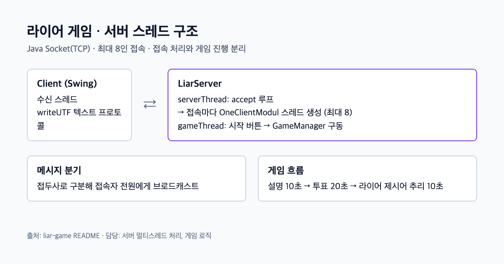
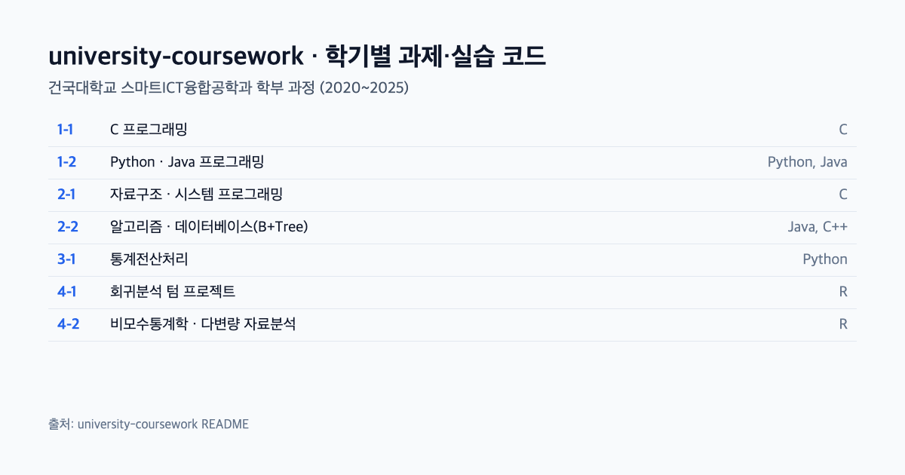

### 데이터와 AI로 사용자의 문제를 찾아 풀고, 기획부터 구현·QA까지 직접 잇는 엔지니어입니다.

> [!NOTE]
> 프로젝트와 경력의 배경·접근·결과는 [**포트폴리오 사이트**](https://parksungyun0411.github.io)에 더 자세히 정리되어 있습니다.

## 🚀 대표 프로젝트

학부 과정에서 수행한 프로젝트입니다. 각 저장소 README에 설계 판단과 결과를 정리했습니다.

<table>
  <tr>
    <td width="50%" valign="top">
      
      <h3><a href="https://github.com/parksungyun0411/jeju-emotion-analysis">제주어 다중감정분류</a></h3>
      제주어/표준어 병렬 코퍼스를 GPT-4o로 7감정 라벨링해 학습 데이터 127,324행을 구축했습니다. 고전 ML의 한계(F1-Macro 0.30)를 먼저 확인한 뒤, Dual-Gated KR-BERT와 KoELECTRA 앙상블로 F1-Macro 0.84를 달성했습니다. 건국대 졸업 프로젝트(4인 팀)입니다.  
      <a href="https://github.com/parksungyun0411/jeju-emotion-analysis"><b>저장소</b></a> 
      PyTorch · HuggingFace · KR-BERT · KoELECTRA · GPT-4o API
    </td>
    <td width="50%" valign="top">
      
      <h3><a href="https://github.com/parksungyun0411/liar-game">라이어 게임</a></h3>
      Java Socket(TCP)과 Swing으로 만든 최대 8인 실시간 멀티플레이어 게임입니다(3인 팀, 네트워크 프로그래밍). 서버 측 멀티스레드 처리와 게임 로직을 맡아, 접속 처리와 게임 진행 스레드를 분리했습니다.  
      <a href="https://github.com/parksungyun0411/liar-game"><b>저장소</b></a> 
      Java · Swing · Socket · Thread
    </td>
  </tr>
  <tr>
    <td width="50%" valign="top">
      
      <h3><a href="https://github.com/parksungyun0411/university-coursework">학부 4년 코드 모음</a></h3>
      2020~2025 학기별 과제·실습 코드를 정리했습니다. 자료구조·알고리즘·데이터베이스·시스템 프로그래밍과 통계 과목을 다룹니다.  
      <a href="https://github.com/parksungyun0411/university-coursework"><b>저장소</b></a> 
      C · Java · Python · R · C++
    </td>
  </tr>
</table>

<!-- 신규 프로젝트는 저장소 공개 후 위 표에 카드로 추가 -->

그 밖의 프로젝트는 [포트폴리오 사이트](https://parksungyun0411.github.io)에서 볼 수 있습니다.

## 💼 경력

### 데이콘

**운영·개발 파트 (서비스 기획 · 풀스택 개발 · QA)** · `2026.04 – 현재`

AI 경진대회 플랫폼 daker를 담당하며 평가 기능의 기획·구현·개발 환경 배포와 플랫폼 QA를 맡고 있습니다.

#### ▎기획·개발

| 프로젝트 | 내용 |
| --- | --- |
| **평가설정 시퀀스 재설계** | 평가 방법이 가중치 토글로 정해져 평가를 여러 번 돌릴 수 없던 구조를, 설정 화면을 세 갈래로 나누고 평가 단계가 설정을 주도하도록 바꿨습니다. 데이터 구조 변경 없이 다차수 평가가 가능해졌고, 기획부터 구현·개발 환경 배포까지 수행했습니다 |
| **ELO 평가 기획·공정성 점검** | 월간 해커톤(62팀 규모)용 역할별 ELO 정규화 룰을 설계했습니다. 출시 전 점검으로 동시 재계산 시 갱신 유실, API 직접 호출 투표, 블라인드 평가의 팀명 노출을 차단했습니다 |
| **순위 신뢰도 시뮬레이션** | 자사 수식을 그대로 쓴 시뮬레이션으로 순위가 실력을 복원하기 시작하는 구간(총 3,000매치)과 상위권 선발의 한계를 산출했습니다. 이를 근거로 가산점 안을 기각하고, 무임승차를 막는 호혜 게이트를 구현했습니다 |

#### ▎운영·유지보수

| 프로젝트 | 내용 |
| --- | --- |
| **교통사고 위험 예측 플랫폼** | NIA 정책 수립 지원 데이터 분석 사업 납품물의 운영·유지보수를 담당합니다(2026.09 전임 개발자로부터 인수인계) |

#### ▎QA

| 항목 | 내용 |
| --- | --- |
| **주간 QA** | 플랫폼 전반의 주간 체크리스트 QA를 맡아 확인된 것만 세어 최소 86회차를 수행했습니다. 통과 여부 대신 재현 조건을 화면 폭 단위로 기록하고, 확인하지 못한 항목은 검증 한계를 적었습니다 |
| **QA 준비 자동화** | 대회·제출물을 손으로 만들던 QA 준비를 시드 커맨드로 자동화했습니다(로컬 브랜치 구현) |
| **화면 상태 정리** | 어드민 하위 탭 새로고침 시 작업 위치를 잃던 문제를 전수 조사해 16개 화면의 탭 상태를 주소에 남겼습니다 |

### 자빅스

**클라우드·엔터프라이즈 서비스 운영팀 인턴** · `2025.05 – 2025.08`

AWS·Azure 기반 클라우드 서비스 운영과 공공 메신저 '온톡'(사용자 약 15만 명, 일 평균 800만 건)의 기능 기획에 참여했습니다.

#### ▎운영·기획

| 항목 | 내용 |
| --- | --- |
| **클라우드 운영·과금** | 고객사 인프라 요청(EC2 등)을 접수해 처리하고, 사용량을 분석해 과금을 산정했습니다 |
| **기업용 계정·단말 운영** | Azure AD 기반 계정 체계와 Microsoft 365 운영을 보조하고 단말 배포 체계 구축을 도왔습니다 |
| **'온톡' 기능 기획** | 조직도 기반 사용자 조회와 대화방 기능 기획에 참여하고, 행정 시스템 연계 구조와 통합 알림 서비스 기획안을 정리했습니다 |

### 너드수학 (한이음 드림업)

**AI 백엔드·엔진 개발 (기획 포함)** · `2025.04 – 2025.11`

AI 개인 맞춤형 수학 학습 플랫폼 팀 프로젝트로, 기여도 40%입니다. 비공개(NDA) 프로젝트라 저장소는 공개하지 않습니다.

#### ▎개발

| 프로젝트 | 내용 |
| --- | --- |
| **Graph-RAG 학습경로 추천 엔진** | 개념 선후 관계를 Neo4j 그래프로 구성하고 진단 데이터를 결합해 8주 학습경로 제안까지 자동화했습니다 |
| **3모드 RAG 챗봇** | 질문을 세 모드로 자동 분류하는 챗봇을 LangChain / LangGraph 워크플로로 구현했습니다. 추천·챗봇 모듈 완성도는 각 90%입니다(한이음 개발보고서 기준) |
| **OCR 문항 파이프라인·추론 서버** | 문항 이미지를 Mathpix OCR로 변환해 DB에 적재하고 참조 무결성을 검증했습니다. FastAPI 추론 서버를 묶음 추론·스트리밍으로 설계하고 컨테이너 배포를 자동화해 추론 응답을 50ms 미만으로 맞췄습니다 |

## 🛠 기술 스택

| 영역 | 기술 |
| --- | --- |
| AI · NLP |        |
| 백엔드 · DB |       |
| 프론트엔드 |    |
| QA · 테스트 |  테스트 설계·TDD, 회귀·정합성 검증, 권한·보안 경계 테스트, 테스트 시드 자동화 |
| 인프라 · 도구 |       |

## 🎓 학력

| 기간 | 학교 | 전공 | 학위 |
| --- | --- | --- | :---: |
| 2020.03 – 2026.02 | 건국대학교 | 스마트ICT융합공학과 (주전공, 4.09 / 4.5) · 응용통계학과 (복수전공, 4.23 / 4.5) | 졸업 |

## 📜 자격증 · 어학

| 자격증 | 발급 기관 | 취득일 |
| --- | --- | --- |
| **정보처리기사** | 한국산업인력공단 | 2025.12.24 |
| **빅데이터분석기사** | 한국데이터산업진흥원 | 2025.12.19 |
| **ADsP (데이터분석 준전문가)** | 한국데이터산업진흥원 | 2025.06.13 |
| **SQLD (SQL 개발자)** | 한국데이터산업진흥원 | 2024.09.20 |
| **컴퓨터활용능력 1급** | 대한상공회의소 | 2024.04.12 |
| **한국사능력검정시험 1급** | 국사편찬위원회 | 2023.08.25 |

| 시험 | 등급·점수 | 응시일 |
| --- | --- | --- |
| TOEIC | **885** | 2024.08.25 |
| TOEIC Speaking | **Intermediate Mid 3 (130)** | 2026.03.14 |
